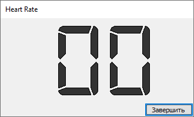
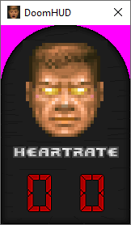
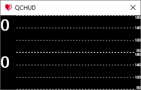

# HeartRate
 Библиотека для подключения к пульсомеру по bluetooth и примеры использования. Идентификатор оборудования вшит в код примеров, перечисления устройств и поиска совместимого оборудования не выполняется. Работает только для конкретного идентификатора моего нагрудного пояса. Для других устройств потребует коррекции кода.

Библиотека работает с winrt, что может потребовать установку дополнительных компонент компилятора.

Библиотека HeartRate.dll собирается без оптимизаций. По каким-то причинам, оптимизации вырезают что-то нужное и соединение с пульсомером перестаёт работать. Я не смог быстро понять проблему и нет желания вникать и тратить на это время.

## Examples

### HeartRateDLL :heartpulse: 
Интерфейс подключения к пульсомеру.

### MFC Heart
Простое диалоговое окно, показыающее пульс.

### Doom Heart
HUD стилизован под Дум. В зависимости от уровня пульса показывается голова протогониста с разной степенью изношенности и пульс, вместо здоровья. Делалось под интерфейс Quake Champions, пульсомер ставится в середину экрана, закрывая статус активного навыка.

### QC Heart
Цветная диаграмма изменения пульса за последние секунды. Разделена на две части: цветное изображение и маска альфа-канала, чтобы сделать красивую прозрачность без использования colorkey. 

